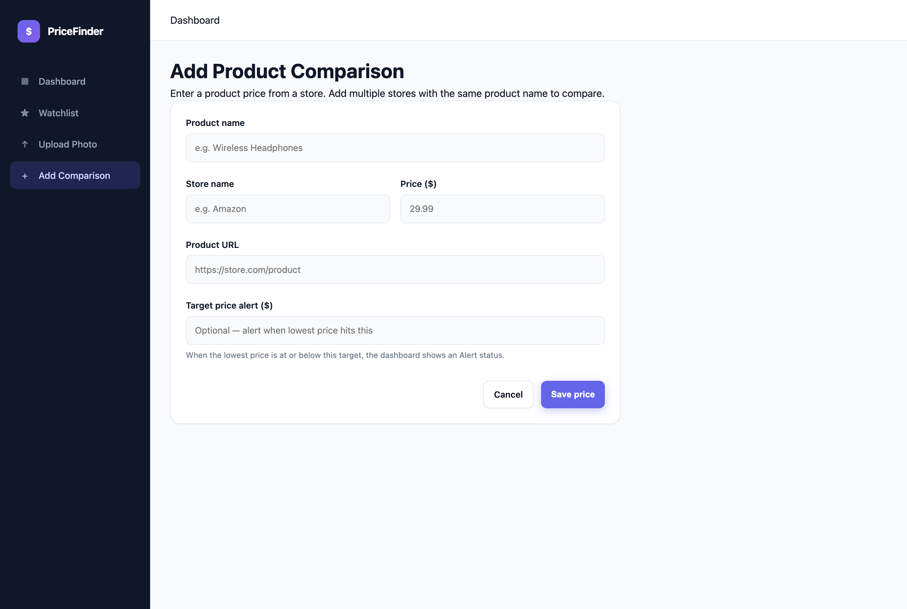
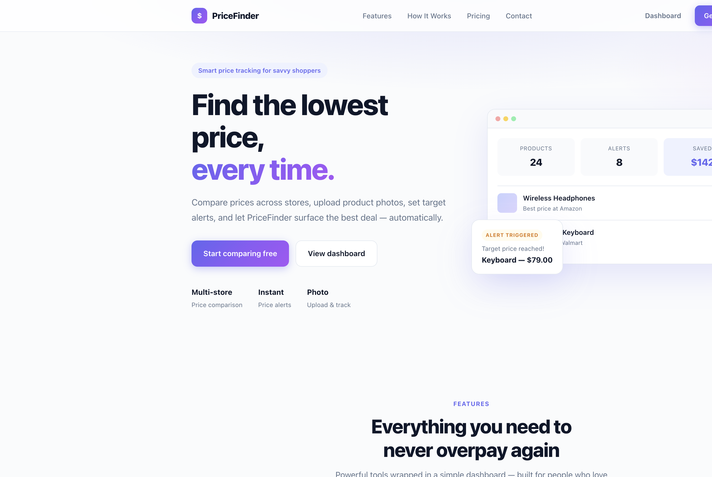
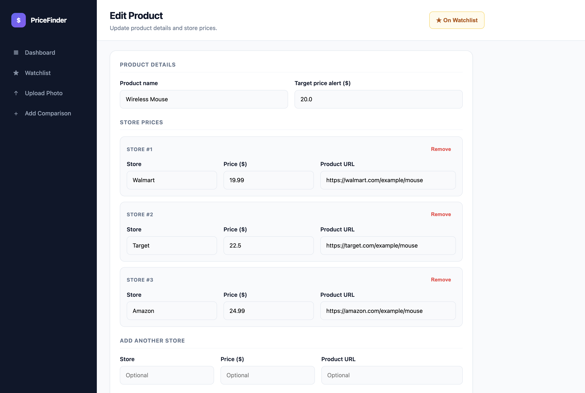
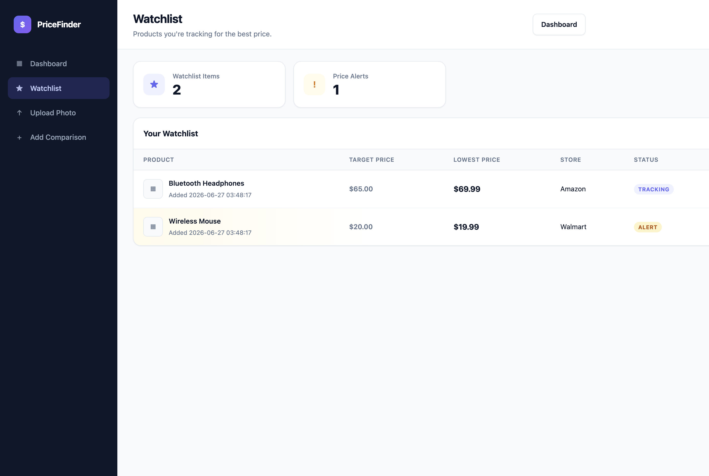
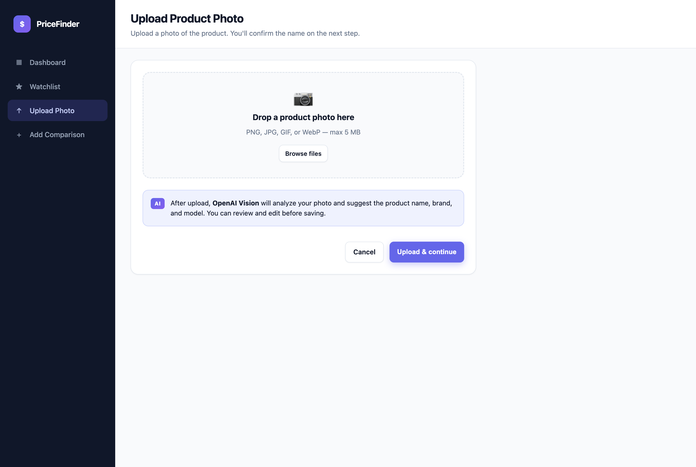

# Lowest Price Finder

A lightweight web application for tracking product prices across multiple stores and surfacing the best deal at a glance. Enter the same product from different retailers, upload a product photo for AI-assisted identification, set optional price alerts, and let the dashboard show only the lowest price per product.


---

## Table of Contents

- [Project Overview](#project-overview)
- [Features](#features)
- [Screenshots](#screenshots)
- [Tech Stack](#tech-stack)
- [Installation Guide](#installation-guide)
- [Configuration](#configuration)
- [Usage](#usage)
- [Project Structure](#project-structure)
- [Future Improvements](#future-improvements)

---

## Project Overview

**Lowest Price Finder** (PriceFinder) helps shoppers and deal hunters compare prices without digging through multiple tabs. Users log the same product from different stores along with URLs and prices. The app stores every entry in SQLite, groups results by product name, and displays a clean dashboard that highlights:

- The **lowest available price**
- The **store** offering that price
- A direct **product link**
- **Alert status** when a target price is met

The dashboard intentionally hides individual store listings so users focus on the best deal, while the edit view provides full control over all tracked store prices.

A public **landing page** introduces the product, and optional **OpenAI Vision** integration can identify products from uploaded photos.

---

## Features

### Core Comparison
- Add product prices from multiple stores under the same product name
- Automatically determine and display the lowest price per product
- Store product URLs for quick access to listings
- Persist all data locally with SQLite

### Dashboard & Analytics
- SaaS-style dashboard with sidebar navigation
- Summary metric cards:
  - **Total Products** — number of tracked products
  - **Total Alerts** — products at or below target price
  - **Average Savings** — average spread between highest and lowest store price
- Search products by name
- Sort by price (low to high / high to low), name, or last updated date
- Savings indicator when multiple stores are compared

### Price Alerts
- Optional **target price** field when adding or editing a product
- **Alert** badge shown when the lowest price meets or beats the target

### Product Management
- Edit product name, target price, and all store entries from one page
- Add or remove individual store prices
- Delete entire products from the dashboard or edit page

### Landing Page
- Modern marketing site at `/` with Hero, Features, How It Works, Pricing, and Contact sections
- Links into the app dashboard and add-comparison flow

### Watchlist
- Add products to a personal watchlist from the dashboard or edit page
- Dedicated watchlist page with target price, lowest price, store, status, and **Buy Now** link
- Remove items from the watchlist at any time

### Photo Upload & AI Recognition
- Upload a product photo (PNG, JPG, GIF, WebP — max 5 MB)
- **OpenAI Vision** analyzes the image and suggests product name, brand, and model
- Review and confirm the detected name before adding store prices
- Product thumbnails shown on the dashboard and watchlist
- Gracefully falls back to manual name entry when AI is unavailable

### Contact Form
- Landing page contact form saves messages to SQLite (`contact_messages` table)
- Displays a confirmation message to the user after submission
- Email delivery is not configured in this MVP — messages are stored locally for review

---

## Screenshots

### Landing Page
Marketing homepage with hero, features, pricing, and contact form.



### Dashboard
Summary metrics, search, sort controls, and a product table with edit/delete actions.



### Add Comparison
Form for entering product name, store, URL, price, and optional target alert.



### Edit Product
Manage product details and update prices across multiple stores.



### Watchlist
Track favorite products with target prices, alerts, and buy links.


### Upload Photo
Upload a product image for OpenAI Vision analysis and name confirmation.



---

## Tech Stack

| Layer | Technology |
|-------|------------|
| **Backend** | Python 3, Flask |
| **Database** | SQLite |
| **Frontend** | HTML5, CSS3, Jinja2 templates |
| **AI (optional)** | OpenAI Vision API (`gpt-4o-mini` by default) |
| **Architecture** | Server-rendered MVC-style Flask app |

### Key Dependencies

- [Flask](https://flask.palletsprojects.com/) — web framework and routing
- [OpenAI Python SDK](https://github.com/openai/openai-python) — optional AI product recognition
- [Werkzeug](https://werkzeug.palletsprojects.com/) — WSGI utilities (Flask dependency)
- [Jinja2](https://jinja.palletsprojects.com/) — template engine (Flask dependency)

---

## Installation Guide

### Prerequisites

- **Python 3.10+**
- **pip** (Python package manager)
- A terminal / command line

### 1. Clone the repository

```bash
git clone https://github.com/your-username/lowest-price-finder.git
cd lowest-price-finder
```

### 2. Create a virtual environment

```bash
python3 -m venv venv
```

Activate the environment:

**macOS / Linux**
```bash
source venv/bin/activate
```

**Windows**
```bash
venv\Scripts\activate
```

### 3. Install dependencies

```bash
pip install -r requirements.txt
```

### 4. Configure environment (optional)

Copy the example env file and add your OpenAI key to enable AI photo recognition:

```bash
cp .env.example .env
```

See [Configuration](#configuration) for details.

### 5. Run the application

```bash
python app.py
```

The app starts on **http://127.0.0.1:5000** by default.

### 6. Open in your browser

Navigate to:

```
http://127.0.0.1:5000
```

> **Note:** On first run, SQLite automatically creates `prices.db` in the project root. No manual database setup is required.

### Optional: seed demo data

```bash
python scripts/seed_demo.py
```

---

## Configuration

Environment variables (set in `.env` or your shell):

| Variable | Required | Description |
|----------|----------|-------------|
| `OPENAI_API_KEY` | No | Enables AI product recognition on photo upload. Without it, users enter the product name manually. |
| `OPENAI_VISION_MODEL` | No | Vision model to use (default: `gpt-4o-mini`). |
| `FLASK_SECRET_KEY` | No | Flask session/flash secret. Defaults to a dev value in `app.py`; change for production. |

Example:

```bash
export OPENAI_API_KEY=sk-your-key-here
python app.py
```

---

## Usage

1. **Visit the landing page** — Browse features at `/`, then click **Get Started** or **Dashboard**.
2. **Add a comparison** — Go to **Add Comparison** and enter the product name, store, URL, and price.
3. **Or upload a photo** — Use **Upload Photo** to let AI suggest the product name, confirm it, then add prices.
4. **Compare stores** — Add the same product name again with a different store and price.
5. **Set a target** — Optionally enter a target price to receive an **Alert** when the lowest price drops to that level.
6. **Review the dashboard** — View summary stats, search, sort, and inspect the lowest price for each product.
7. **Use the watchlist** — Star products on the dashboard to track them on the **Watchlist** page.
8. **Edit or delete** — Use the action buttons on each row to update store prices or remove products.

### Example workflow

| Step | Product Name | Store | Price |
|------|--------------|-------|-------|
| 1 | Wireless Mouse | Amazon | $24.99 |
| 2 | Wireless Mouse | Walmart | $19.99 |
| 3 | Wireless Mouse | Target | $22.50 |

**Dashboard result:** Lowest price **$19.99** at **Walmart**, with **$5.00** savings vs. the highest listed price.

### Viewing contact submissions

Contact form messages are saved to the `contact_messages` table in `prices.db`. You can inspect them with any SQLite client:

```bash
sqlite3 prices.db "SELECT name, email, message, created_at FROM contact_messages ORDER BY created_at DESC;"
```

---

## Project Structure

```
lowest-price-finder/
├── app.py                  # Flask routes and application logic
├── database.py             # SQLite schema, queries, and data access
├── images.py               # Image upload helpers
├── vision.py               # OpenAI Vision product recognition
├── requirements.txt        # Python dependencies
├── .env.example            # Example environment variables
├── LICENSE                 # MIT License
├── prices.db               # SQLite database (created at runtime)
├── scripts/
│   └── seed_demo.py        # Optional demo data seeder
├── docs/
│   └── screenshots/        # README screenshots
├── static/
│   ├── css/
│   │   ├── style.css       # App dashboard styles
│   │   └── landing.css     # Landing page styles
│   └── uploads/            # Uploaded product images
└── templates/
    ├── base.html           # App layout with sidebar navigation
    ├── landing.html        # Marketing landing page
    ├── index.html          # Dashboard
    ├── add.html            # Add product comparison form
    ├── edit.html           # Edit product and store prices
    ├── watchlist.html      # Watchlist page
    ├── upload.html         # Photo upload form
    └── upload_confirm.html # AI detection review & name confirmation
```

---

## Future Improvements

- [ ] **Automatic price scraping** — Fetch live prices from product URLs on a schedule
- [ ] **Email / push notifications** — Alert users when target prices are reached (contact form email delivery)
- [ ] **Price history charts** — Visualize price trends over time per product
- [ ] **User accounts & authentication** — Multi-user support with private product lists
- [ ] **CSV import / export** — Bulk upload and download of product data
- [ ] **Category tags** — Organize products by type (electronics, groceries, etc.)
- [ ] **Dark mode toggle** — User-selectable light/dark theme
- [ ] **REST API** — Expose endpoints for mobile apps or third-party integrations
- [ ] **Docker support** — Containerized deployment for production environments
- [ ] **Unit & integration tests** — Automated test coverage with pytest

---

## Contributing

Contributions are welcome. Feel free to open an issue or submit a pull request with improvements, bug fixes, or new features.

---

## License

This project is open source and available under the [MIT License](LICENSE).
